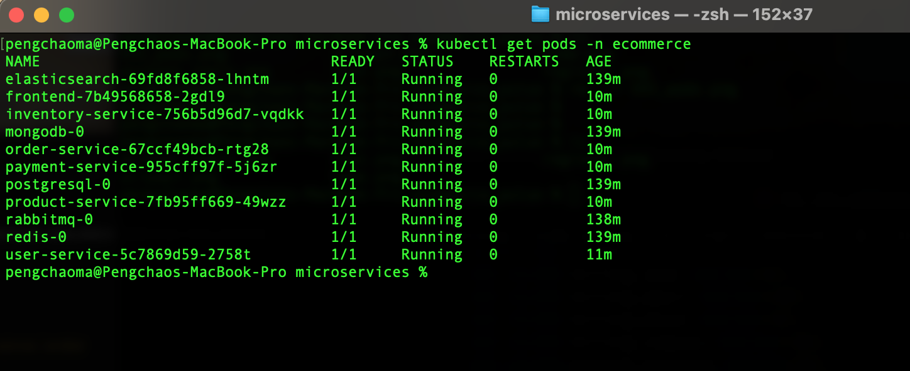
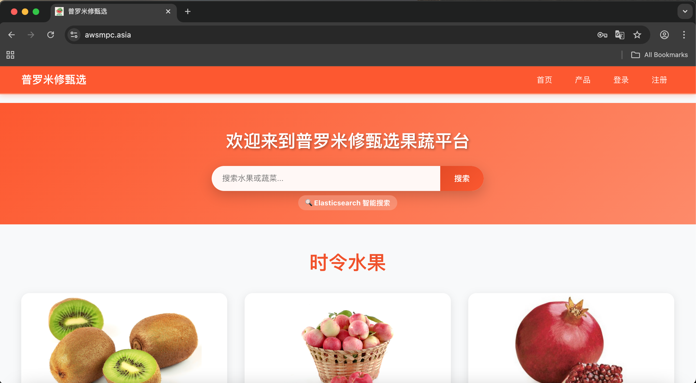
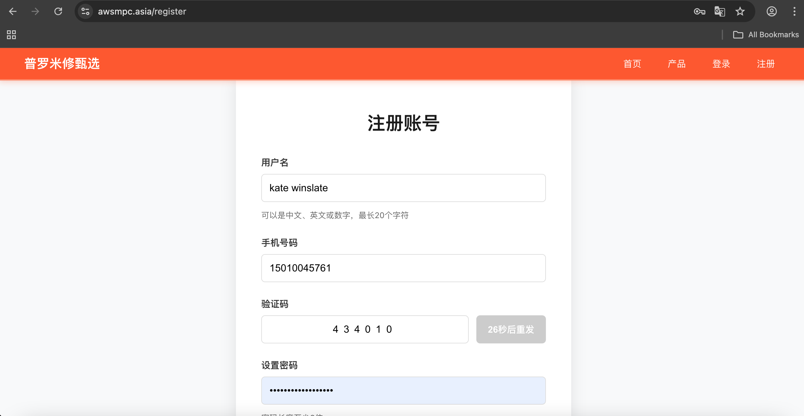
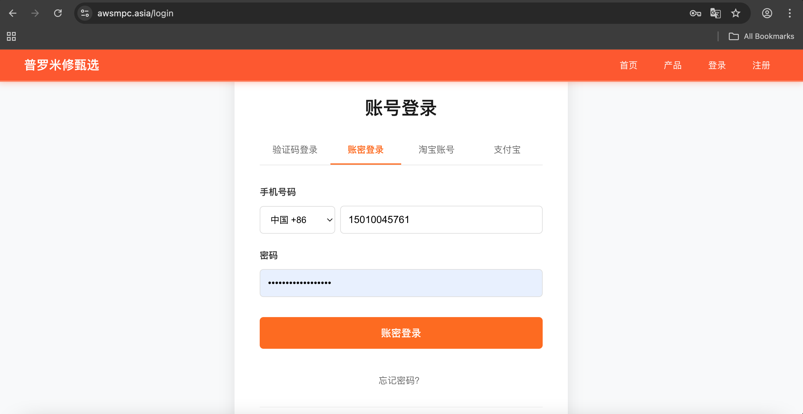
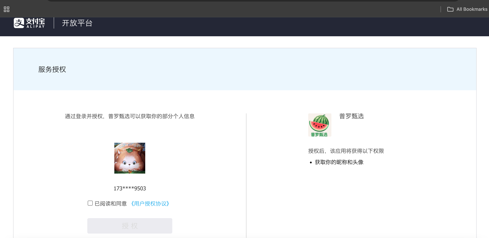

# Spring-Boot-Microservices-Fullstack-Shopping-AWS-EKS

- In this demo I will use React + Spring boot for a fullstack online shopping website

## Architecture

- Frontend 
```
    - React + React Router DOM         // Route
    - Axios/Fetch                      // HTTP client
    - Redux/Zustand                    // State management
    - Tailwind CSS/MUI                 // UI
    - Vite/CRA                         // Build
    - Nginx.conf
    - Dockerfile
```

- Backend  
```                            
    - user-service                     // SMS, Alipay login open.alipay.com API service
    - product-service
    - order-service
    - payment-service                  // Alipay SDK
    - inventory-service
    - notifation-service               // In development
                                       // All Microservices
```

- Main tech stack
```
    - Spring-boot     RESTfull API 
    - gradle 
    - AWS ALB ingress                    // Service discovery
    - AWS EKS                            // all pods running on EKS
    - Dockerfile
    - AWS ECR                            // Docker push image to ECR
    - Terraform to Create ECR
    - Terraform to Create AWS API Gateway
```

- Database
```
    - Postgresql                         // main database
    - Mongodb                            // inventory database
    - Redis                              // SMS store and cache data store databse
    - ElasticSearch                      // Search service 特别是 模糊查询
```

- Message Queue Service
```
    - RabbitMQ
```
- CDN Service
```
    - AWS CloudFront
    - AWS S3 bucket                       // For store images 
```
- Plartform
```
    - AWS EKS with Ubuntu node
    - AWS EBS csi driver
    - AWS alb-ingress-controller
    ...
```

- CI
```
    - All codes stored in Gitlab
```

- CD
```
    - Jenkins for the CD with Jenkinsfile and running on jenkins agent node 
```

- MicroServices running on EKS




## Features

- Here is the home page looks like



- User service register 



- Login module



- Alipay login module




